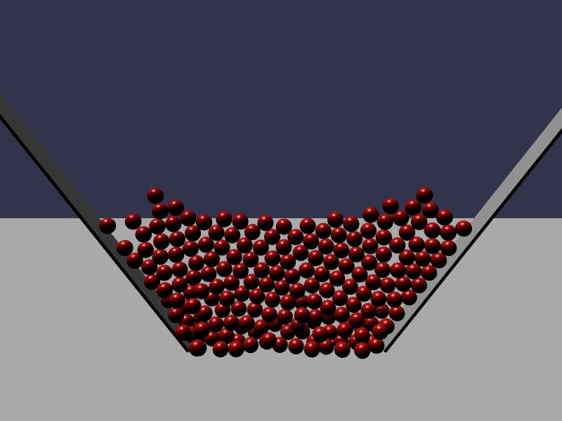

```typescript
import { Matrix, Vector3 } from '@babylonjs/core/Maths/math.vector';
import { MeshBuilder, SceneCallback, createBox, createFloor, getMaterial } from '../util/example';
import { Quaternion } from '@babylonjs/core/Maths/math.vector';
import { PhysicsImpostor } from '@babylonjs/core/Physics/v1/physicsImpostor';
import '@babylonjs/core/Meshes/thinInstanceMesh';
import { ThinPhysicsNode } from '@phoenixillusion/babylonjs-jolt-plugin'
import { Scene } from '@babylonjs/core/scene';

export default (_scene: Scene): SceneCallback => {

    createFloor();

    createBox(new Vector3(-12, 8, -5), Quaternion.RotationAxis(new Vector3(0, 0, 1), 0.2 * Math.PI), new Vector3(0.1, 10, 1));
    createBox(new Vector3(12, 8, -5), Quaternion.RotationAxis(new Vector3(0, 0, 1), -0.2 * Math.PI), new Vector3(0.1, 10, 1));

    const sphere = MeshBuilder.CreateSphere('sphere', { diameter: 1, segments: 32 });
    const extents = new Vector3(0.5, 0.5, 0.5);
    for (let x = 0; x < 20; ++x)
        for (let y = 0; y < 10; ++y) {
            const matrix = Matrix.Translation(-10 + x, 10 + y, -5);
            const idx = sphere.thinInstanceAdd(matrix);
            sphere.material = getMaterial('#ff0000');
            new PhysicsImpostor(new ThinPhysicsNode(extents, idx, sphere), PhysicsImpostor.SphereImpostor, { mass: 1, friction: 0, restitution: 0, disableBidirectionalTransformation: true });
        }
}
```

### 2D Funnel (Instanced)

This demo functions the same as [2D Funnel](./2d_funnel.md), but uses thin instanced meshes.

#### Thin Instance
[Thin-Instances](https://doc.babylonjs.com/features/featuresDeepDive/mesh/copies/thinInstances) are a concept where a Mesh possesses one copy of model-data and material, such as a single ball that is colored red, but multiple "model-transforms". Most often, this is a single model that is used in multiple locations and rotations, but it may also have multiple scales. This is represented by having a single BabylonJS mesh with an internal array of multiple Matrix, each acting as it's own 'instance'

#### Usage in Demo

The 2 important imports in this are `thinInstanceMesh` from BabylonJS to enable this feature, and `ThinPhysicsNode` from the Plugin. The first enables an optional features in the BabylonJS library to activate this feature. The second imports a class the Physics library can use to access the single ThinInstanceMesh matrix. 

The beginning of the demo starts the same as [2D Funnel], creating the Floor and two funnel boxes.
The next step diverges. A single mesh is made outside the loop.
The same 200 iterations are made to populate the funnel red spheres, but during each iteration the Thin Instance is informed to create a new instance matrix, and a Jolt Physics entry is made referencing this Instance ID.

### Special Behavior

The ThinInstanceImpostors do not exist in the Scene Graph. Deleting the scene itself will also iterate through and clean up the corrisponding Physics Impostors, but there is currently no automated behavior to delete them upon the removal of the ThinInstanceMesh. It is recommended to code this yourself using a single onDispose listener on the Mesh.

The field `disableBidirectionalTransformation` is used, and is encouraged in cases where you expect Physics to drive the location/orientation of a model. By default, BabylonJS will check for a graphical model Node moving (such as JS code modifying a model Node's position XYZ) and then forcing this to occur in the Physics world via SetPosition and SetRotation. 