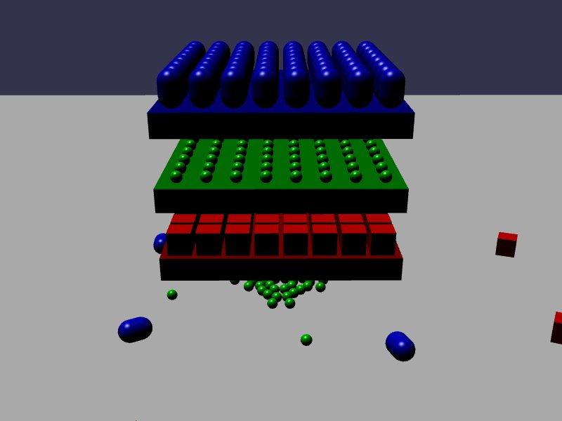

[src/scene/alternative_collision_filtering.ts](../src/scene/alternative_collision_filtering.ts)  

### Alternative Collision Filtering

This demo replicates JoltPhysics.js alternative collision filtering demo.
This demo declares a Mask based collision configuration.

Multiple stacks of blocks are defined, each flagged as an independent layer.
Multiple Bodies are defined that can collide with either the floor (all layers) or their own respective layer.
