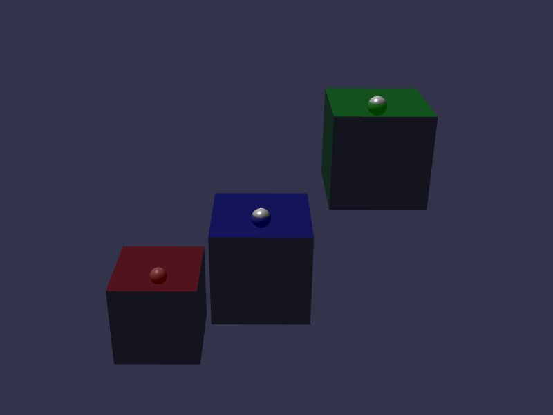

[src/scene/buoyancy.ts](../src/scene/buoyancy.ts)  

### Buoyancy

This demo demonstrates the Buoyancy feature of Jolt.

Similar to Gravity Override, this feature will make a call every physics frame to apply a force/impulse to a Body.

This force is defined using Plane in Jolt, and this demo uses one of the pre-defined Plugin BuoyancyInterface, a BuoyancyPlane.

Jolt will float a given body under the rules that the Plane defines a single infinite plane above the body.

The demo has three Body spheres, and each one is registered to their own BuoyancyPlane.
