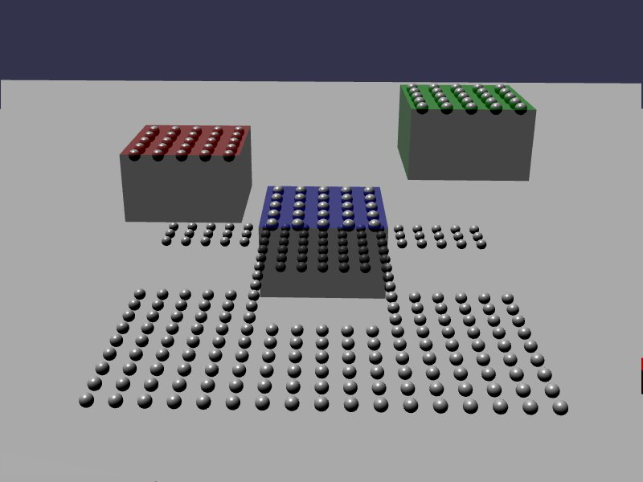

[src/scene/buoyancy_aggregate.ts](../src/scene/buoyancy_aggregate.ts)  

### Buoyancy: Aggregate

This demo demonstrates the Buoyancy feature of Jolt using a more complicated Interface, the pre-defined BuoyancyAggregate.
This interface declares various non-axis aligned Bounding Box to declare regions. When a given body intersects with this region, it will call the internal BuoyancyInterface.

This demo declares various regions and defines a single Plane per region.
