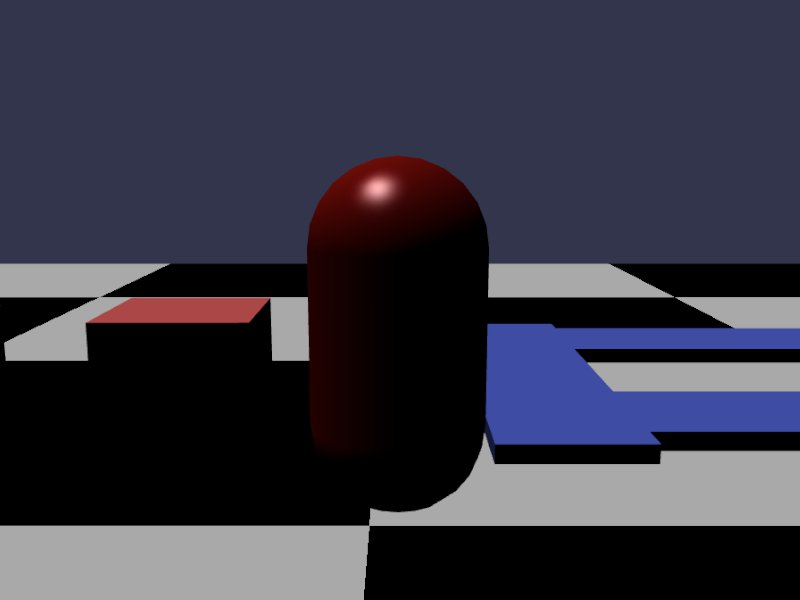

[src/scene/character_virtual.ts](../src/scene/character_virtual.ts)  

### Character Virtual

Jolt possesses two types of Character types.
* Character - a body in the system that has physics applied to it as if it was a noramal object.
* Character Virtual - implemented in the Plugin. This is not actually a body or shape in the simulation. Some time outside of the physics step, the character collision logic will be run, checking a spot in 3d space and simulating as if a Jolt Shape was at that location, acting with a specific velocity, mass, and orientation.

This plugin implements a character using a custom Physics Impostor. At this moment, it does not support changing the shape mid-simulation.

The PhysicsImpostor takes a custom input-controller that will supply per-frame modifications to the Character Virtual.
A supplied 'standard' handler is supplied that supports moving and jumping. Additional more advanced controls can be done using the `CharacterVirtualInputHandler` class that expects the following methods:
* processCharacterData - This method is designed to recalculate the characters target movement vector given gravity, collision with the ground, jump-state, and other user and physics driven factors
* updateCharacter - This method will take the above end-result directional velocity and apply it to the character 

During the pre-physics update routine of the character, the Character's velocity will be calculated, then applied to the character, before finally running the 'Extended Physics Update'.

This routine will apply physics to the virtual character and trigger physics events wired to the PhysicsImpostor.

The character has various configurations available, such as 'stick to floor' or 'walk stairs'.
* Enable Stick to Floor - when walking down an incline at a sufficient speed, if you would normally "go so fast, you fly off the incline, losing contact with the ground", instead you will be teleported down to the floor assuming it is not too far away.
* Enable Walk Stairs -  when you would run into a low height step, instead teleport up to the top of that height, treating it as a step in stairs.

The following properties of a character can be changed at runtime using the `JoltCharacterVirtual.config`:
* Shape
* Strength
* Mass
* Max Slope Walkable
* Object-Penetration Recovery Speed
