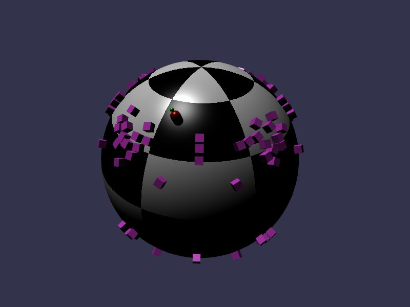

[src/scene/character_virtual_sphere_world.ts](../src/scene/character_virtual_sphere_world.ts)  
[src/scene/character_virtual_ribbon_world.ts](../src/scene/character_virtual_ribbon_world.ts)  

### Character Virtual: Gravity

This will allow for controlling a character in non-standard gravity, such as spherical gravity in the mini-planet "Sphere World" demo, or the more abstract "Ribbon World" demo that defines gravity along a twisting surface.
