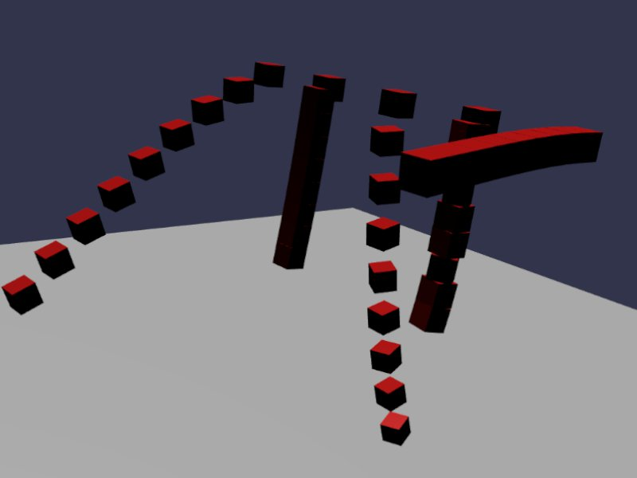

[src/scene/constraints.ts](../src/scene/constraints.ts)  

### Constraints

The constraints demo uses 5 of the constraint types, demonstrating the creation of chains of bodies. The chains have force applied to demonstrating the swinging behavior and more easily display the qualities and restrictions of a constraint.

A 'collision' property is used to configure a raw Jolt Collision FilterGroup for the bodies. This property makes it so that in a given chain, Body N and Body N+1 can not collide and are allowed to freely pass through each other.

A chain is constructed by creating a series of Box, and fixing the top element into place by setting a mass of 0. The bodies are then placed along the Z-direction, so that upon starting the simulation, they will fall downward and create a swinging motion on the Z axis if possible. An impulse is applied on the X direction to cause additional swinging and more clearly demonstrate multi-axis constraint behavior.

Constraints limit how one Body may move with respect to another Body. One of the more obvious is a Hinge constraint (JoltHingeJoint). In the case of a door, one body would be the doorframe, and the other would be the door itself. The constraint would define the location of the hinge, where the joint-like behavior exists at the actual physical joint, and the rotation axis is vertical. The Normal axis would define the angle of "closed", pointing horizontally across the door. Telling the hinge to 'go to 0 degrees' will swing the door to this 'closed' position, while 'go to 90 degrees" will open the door.

The constraint points may actually be offset from the objects themselves. In this door situation, the door itself may be smaller than the doorframe (like a saloon door in an old western), and you define the Hinge floating in between the two bodies. In this case you may picture an invisible steel rod extends from the center of a body (such as the door and frame) to the defined offset, and these invisible rods are instead connected to the hinge.

The following constraints are used:
* Fixed - this connects two bodies as if you had super-glued the two bodies together. The bodies are not welded, or cemented, but instead fixed as if a super hard rubber, so forces applied to them may still strain them. The demo shows that the bodies do hang down slightly, even if conceptually you think it should act like a ridged z-index chain singular block.
* Point - this connects such that a given point on one body must always attempt to touch a given point on another. You may think of the objects being bound by an infinitely short string at this point, or connecting infinitely small needles from either body such that they can swing in any direction they want. Conceptually, I think of this as a chain of diamond shaped beads, connected by their top and bottom points.
* Distance - This constraint fixes it so that two bodies attempt to remain between a minimum and maximum distance from their Point. Conceptually, I think of this as a chain with strings connecting every subsequent body together.
* Hinge - As previously described, these operate like door hinges. A minimum and maximum angle may be given for hinge, and the hinge will attempt to remain in this range, although excess force can strain this requirement.
* Slider - Slider constraints attempt to remain fixed in 2 axis (such as X/Y) and allows a distance constraint in the third (such as Z). This allows them to freely 'slide in/out'. Conceptually, a sliding door follows this constraint (sliding in an X-axis), or a drawer in a piece of furniture (sliding towards the user). 
