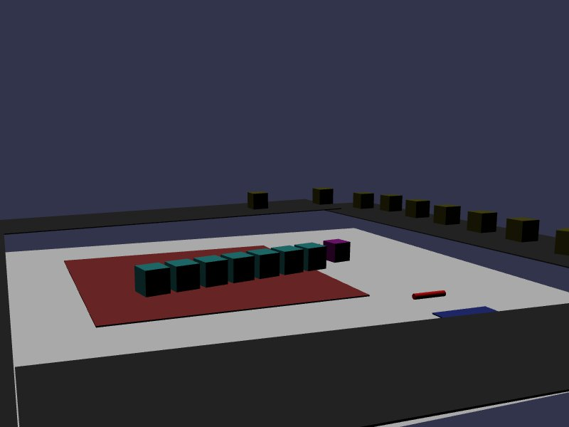

[src/scene/conveyor_belt.ts](../src/scene/conveyor_belt.ts)  

### Conveyor Belt

This demo demonstrates a feature of the Jolt-specific contact listeners, `on-contact-add` and `on-contact-persist`.

These methods include the properties `relativeLinearSurfaceVelocity` and `relativeAngularSurfaceVelocity`.
Note: This feature simplifies some of the Jolt behavior, limiting this functionality to only allow rotation and linear motion with regard to the center-of-mass and local-space of a given shape.

The demo starts by creating four conveyor belts around the perimeter of the scene. Each belt leads to the next belt in a sequence, inclining slightly and dropping boxes off onto the next belt.

Ten boxes are created and dropped onto the belt to start a clock-wise motion from belt-to-belt, with each box having between 0.0 and 1.0 friction.

These 4 belts are registered to have Jolt contact events with the 10 boxes, and during the callback to set a -10 z-axis velocity, pushing them along the belt.

At the center of the scene is a single red box, compressed to thin platform, with six boxes placed on it. These items are all registered to listen for contact events, and apply a relative angular velocity around the red platform's center, causing the boxes to spin around the center.

The final active element on the page is a conveyor belt spawned with two cylinders under it and a box on top of it. This Body demonstrates that a conveyor-belt linear velocity, when applied to a non-static Body, will cause expected equal and opposite interactions with bodies in contact with it.