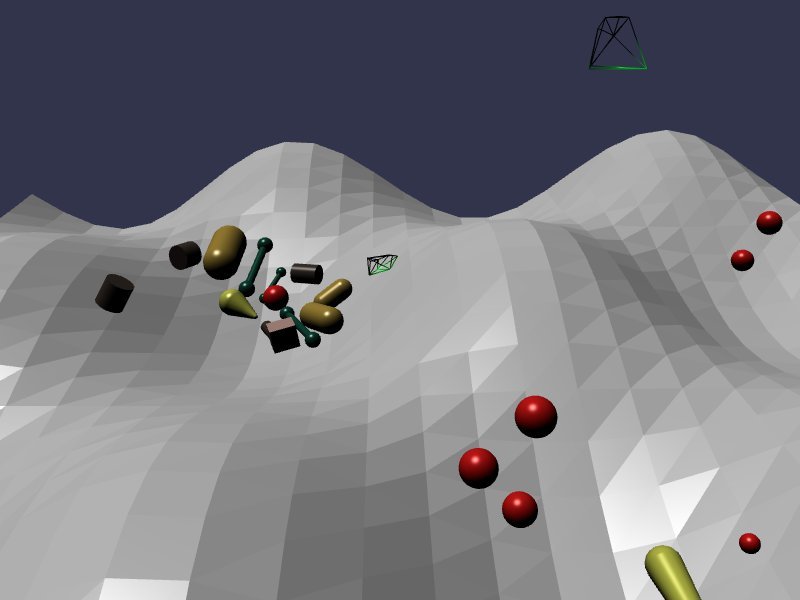

[src/scene/falling_shapes.ts](../src/scene/falling_shapes.ts)  

### Falling Shapes

This demo shows the various shapes that are supported by Jolt.

* Mesh - The floor of the created using `createMeshFloor`, which constructs a Mesh using positions and triangle index.
* Sphere - a physics shape consisting of a center and radius
* Box - a physics shape consisting of a height, width, and depth
* Cylinder - a physics shape consisting of a height and radius
* Capsule - a shape consisting of a height and radius. Radius will also apply to the half-sphere caps of the capsule shape, compared to a Cylinder
* Tapered Capsule - similar to a capsule, but allowing for a different radius a the top and bottom of the shape
* Convex Hull - a shape encapsulating a collection of points, as if shrink-wrapping them. No concave angles exist on the resulting shape. Demonstrated by wireframe green objects.
* Static Shape - a compound shape, consisting of any allowable Jolt shape but assigned a single Body in the physics simulation. Demonstrated by bar-bell designs.

The physics simulation will iterated over random positions, angles, and shapes, and drop them on the Mesh Floor uneven surface until 100 items have been dropped.