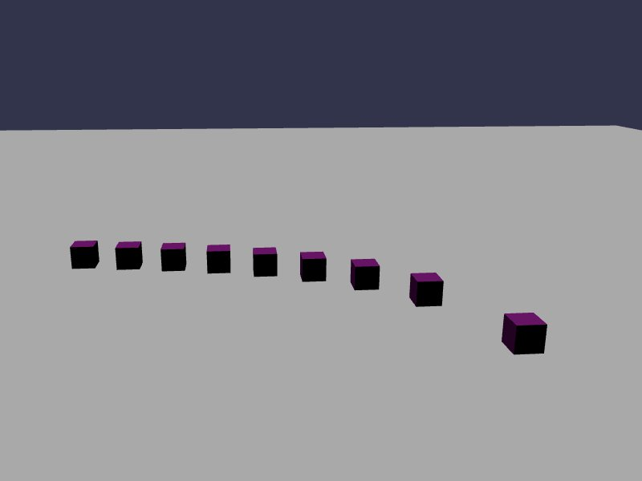

```typescript
import { Quaternion, Vector3 } from '@babylonjs/core/Maths/math.vector';
import { SceneCallback, createBox, createFloor } from '../util/example';
import { Scene } from '@babylonjs/core/scene';

export default (_scene: Scene): SceneCallback => {
  createFloor({ friction: 0.8, mass: 0, restitution: 0 });

  for (let i = 0; i < 10; i++) {
    // Create physics body
    const position = new Vector3(-10.0 + 2.0 * i, 0.5, 0);
    const box = createBox(position, Quaternion.Identity(), new Vector3(0.5, 0.5, 0.5), { mass: 10, friction: 0.1 * i, restitution: 0.2 }, '#990099');
    box.physics.applyImpulse(new Vector3(0, 0, 100), position);
  }
}
```

### Friction

This demo demonstrates the interaction of friction between two surfaces.
The first call `createFloor` creates a floor object with 0 mass (meaning it will never move), and provides a level of friction. The `restitution` value is set to 0, so there is no 'bounciness' to the floor.

A series of 10 cubes are spawned across the floor. The `createBox` method accepts 'half-extent' values, and spawns the item around the povided point. This means that each Box will be spawned with a resulting height/width/depth of 1.0 at exactly `position`.
Each Box is given a `mass` of 10 and a friction value ranging from 0.0 to 1.0.

The final step is to apply an impulse (push) directly at the center of the boxes, pointing towards the camera.

Upon running, you can see how each box slides towards the camera, with the high-friction values stopping almost immediately, and the 0-friction box sliding all the way off the Floor and into the void.
