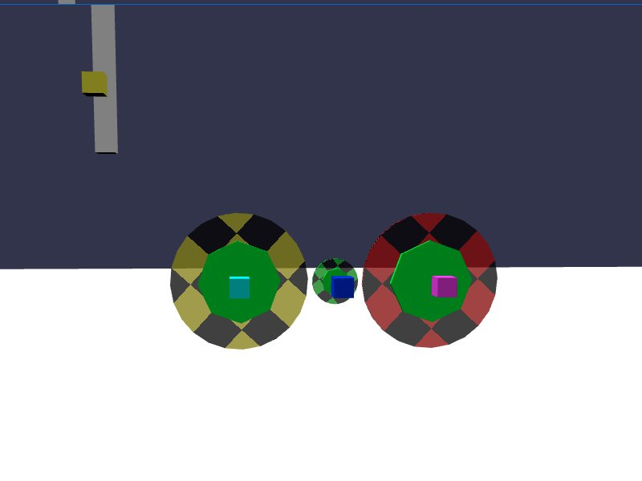

[src/scene/gears.ts](../src/scene/gears.ts)  

### Gears and Rack & Pinion

Gears are a form of compound constraint.
They are implemented in the Plugin using a JoltGearConstraint.
They are composed of two Hinge constraints, and structured so that the turning of one Hinge will cause a relational turn of the associated hinge.

Rack and Pinion are a similar constraint, implemented via JoltRackAndPinionConstraint.
These are implemented using a slider (rack) and associated hinge constraint (the gear, known as the pinion).

The demo sets up a set of gears, composed of two large gears connected by a smaller inner gear.
There is an optional method on the Jolt gear constraint that will add a hint to assist in synchronizing the gears, which in the Plugin is called `setJointHint`.

It is not especially clear, but it appears that the hint will take "the body the Joint is added to via `addJoint`" as parameter 1, and associated second gear as parameter 2.

Note: Failure to add the hint in the proper order, or other mistakes in the order of gear parameters may trigger rapid simulation destabilization. 
The rack and pinion constraint is more direct, with Body1 and Body2 being required to be have specific 'Rack' or 'Pinion' components for the hint.
