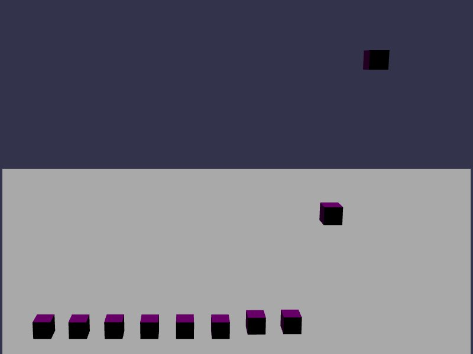

[src/scene/gravity_factor.ts](../src/scene/gravity_factor.ts)  

### Gravity Factor

This demo displays the Gravity Factor function of Jolt.

This will scale the influence of gravity on any body, allowing some objects to have no gravity at all, or increasing and decreasing gravity on individual bodies.

This feature should have better performance than Gravity Override functionality as it is completely contained in Jolt's internals.
