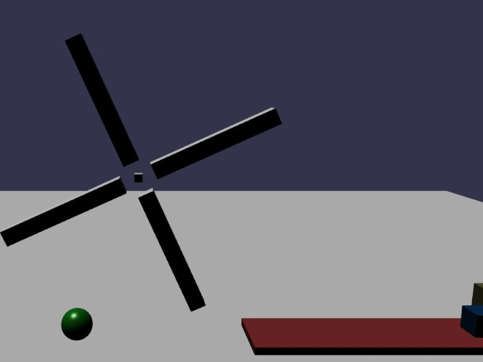

[src/scene/gravity_override.ts](../src/scene/gravity_override.ts)  

### Gravity Override

This demo displays the Gravity Override utility of Jolt.

This is not a native feature, but instead uses a per-frame callback to re-apply forces to a Body, setting the system-wide gravity influence (Gravity Factor) to zero until the GravityOverride is once-again set to null.

Existing GravityInterface are declared in the Plugin for:
1) GravityVector - declares a single directional gravity that will apply in a given direction every frame, ex: 9.81 downward
2) GravityPoint - declares a single point that will pull (positive magnitude) or push (negative magnitude) from this point
  * This can quickly simulate a mini planet if placed inside a sphere, or a dyson-sphere or ring-world if place inside a system a pushed outward against the ring/sphere interior.
