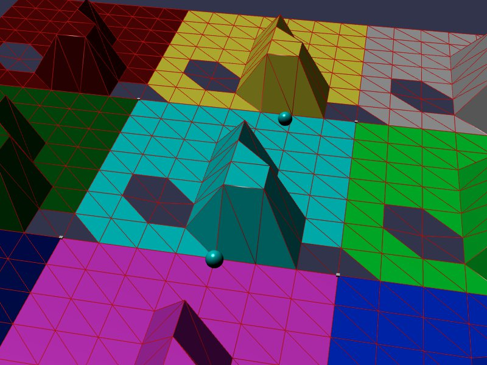

[src/scene/heightfield-tiling.ts](../src/scene/heightfield-tiling.ts)  

### Heightfield Tiling

This demo uses the Jolt Heightfield Shape to tile together multiple heightfields, and show the internal mesh shaping.

One of the goals of this demo is to show how edges are formed, and be clear on which direction the triangular mesh underlying the field renders on a hill. 

The image data is manually constructed into a Uint8 array to allow for visibility into the raw data, and easy manual modification.

The `createMeshForShape` call is used to extract the underlying Jolt mesh.

Two spheres are created to roll across the resulting tiled heightfields. One of the spheres is configured to roll as far as possible to ensure no visible impact from transitioning between heightfields. The second is configured to hit a triangular hill at such an angle that it will deflect off the surface.

Holes are created in the Heightfield:
* One in the middle of the field, creating a large hole, as it shares vertex with many surrounding tiles.
* One created in the corner, where it touches only one triangle, creating the smalled triangular hole
* One created in an opposite corner, where it touches two triangle, creating a square hole