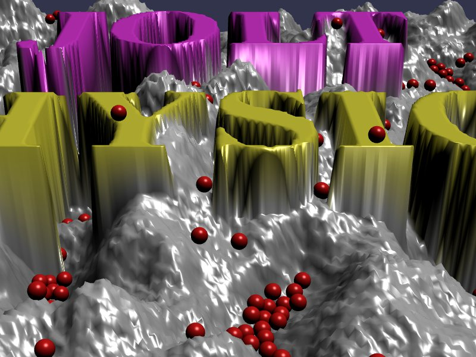

[src/scene/heightfield.ts](../src/scene/heightfield.ts)  

### Heightfield

This demo uses the Jolt Heightfield Shape.

This shape uses an image to create a BabylonJS terrain and a Jolt Heightfield shape.

The BabylonJS aspect is created using CreateGroundFromHeightMapVertexData,  which will take the supplied RGBA values, assuming 0 to 1.0 in each channel, and create a single 0.0 to 1.0 height. This value is then scaled between the resulting min and max height properties, and the values are stored in a Float32 array. 

An 'alphaFilter' property is used to flag pixels that should create holes in the height map.
