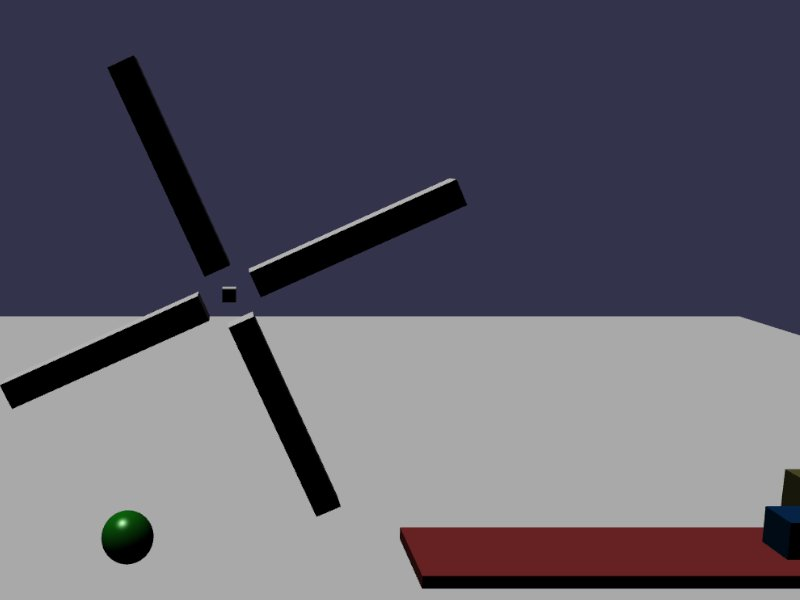

[src/scene/motor.ts](../src/scene/motor.ts)  

### Motor

This demo shows the usage of the 'motor' attribute on the Jolt Joints. The plugin has simplified some of the behavior compared to the raw JoltJS SDK, and routed control to a `MotorControl` object.

This object has the following properties:

* mode = Position, Velocity, Off
* target = the desired angular or velocity target

Two structures are constructed in the demo:
* A windmill, made of 4 boxes rotating around a single axis object, using a velocity setting on a hinge. This means that the hinge will attempt to maintain a specific angular velocity.
	* Angular vs Linear velocity of motors depends on the Joint/Constraint, not any value given to `mode`
	* The windmill will strike a free-rolling ball that starts on the left side of the scene and rolls right.
* A slider on a platform. The sliding box is constraint with a block at the end of the platform. This constraint motor will set the 'position' of the slider constraint every two seconds.
	* The constraint-point of the sliding box is world space
		* This means the point being dragged is point2, as located relative to `box`'s physics shape
	* target = 0 will move the box's constraint-point2 to point1 on the slider axis
	* target = 10 will move the box to 10-units away from point1 on the axis, approximately on the left-side of the slider's platform. 
	* You can modify this `target` as desired to see the impact. Setting it to negative numbers may attempt to pull the box beyond the rightmost end-block. Setting to values larger than 10 may pull the box farther leftward, under the windmill.