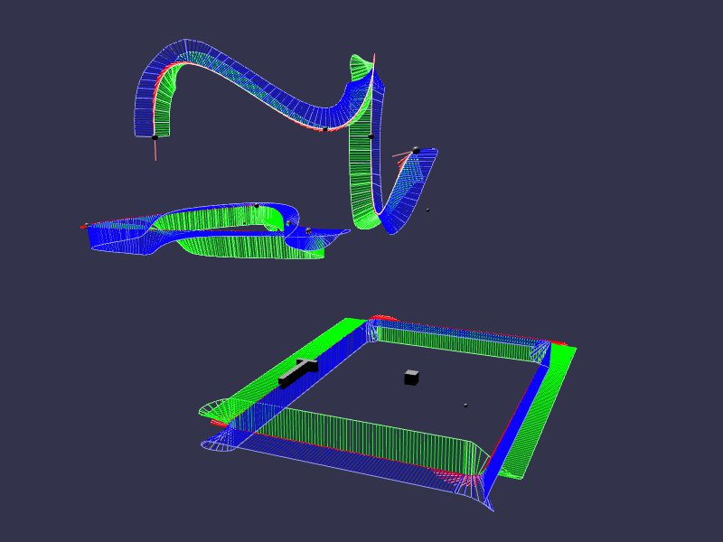

[src/scene/path-constraint.ts](../src/scene/path-constraint.ts)  

### Path Constraints

Path constraints are one of the more advanced constraints of Jolt. They work in two parts:

1. The Path - a class/object defining a movement and orientation moving through 3d space, between a start and end point (or loop, should the start and end be the same point) . You may think of this as a roller coaster, where it may loop and spiral and twist, but must always keep heading down-path towards the end of the coaster.  
2. The Constraint - a Jolt constraint that binds an object to the path, relative to a secondary body. Conceptually, you can think about this as the Moon and Earth. The Moon (body2) follows path a fixed path around Earth (body1). In Jolt, the earth may be considered static or dynamic should it be moving through space, but the Moon will be constrained to the orbital path.   

The demo creates multiple paths, using utility methods to create and display paths as they move through space. A shape is places on one of the paths, and moves along it, demonstrating the shape obeying defined tangents and normals of a complicated 3d navigation.

#### Plugin Usage

The plugin supports several helper methods for creating path constraints. These also take a corresponding list of normals on each point, allowing the path to twist and turn as is traverses from one point to the next. The routines accept a resolution value and options to make the path looped, and creates a BabylonJS [`Path3D`](https://doc.babylonjs.com/typedoc/classes/BABYLON.Path3D).

* `createPath3DWithCurvedCorners` - this will take a collection of points, such as a square or triangle, or other form with sharp corner transitions, and smooth them out so that they easily ease and do not break any path processing routines.
* `createPath3DWithHermitePath` - this will take a collection of points and tangents, and create a hermite path [see BabylonJS doc](https://doc.babylonjs.com/features/featuresDeepDive/mesh/drawCurves#hermite-spline)
* createPath3DWithCatmullRomPath - this will create a Catmull Rom path between all the points [see BabylonJS doc](https://doc.babylonjs.com/features/featuresDeepDive/mesh/drawCurves#catmull-rom-spline)
* createPath3DWithTan2CubicBenzier - this path helper is based upon the notation used in Unity's spline utility. Each point N in the equation has a tangent heading N+1 and N-1, used to strengthen or weaken the curve as it enters or leaves the point. 

The Plugin's JoltPathConstraint (joint) accepts a  Path3D and a constraint mode. These are:
* `'Free'` - The body2 will act as if is PointConstrained to the path. It will freely wobble, rotate, and spin around this the constraint point on the path.
* `'ConstrainAroundTangent'` - The body2 will be axis-locked to the tangent, but may spin around the tangent vector as it navigates the path, as if a drill pointing down the path.
* `'ConstrainAroundNormal'` - The body2 will be axis locked to the normal, but may spin around the normal as if a merry-go-round along the path.
* `'ConstrainAroundBinormal'` - The body2 will be locked to the axis orthogonal to both the tangent and normal. In a circle, this axis points from the center of the circle out of the circle, and if 'Normal' is up and you are riding a roller coaster, this axis is to your left/right. The body2 may 'roll' freely on this axis, doing backflips along the direction of the path
* `'ConstrainToPath'` - body2 is locked in all axis towards the path. This is the most common mine-cart and roller-coaster, with no free motion in any axis, and requiring the body2 exactly follows the path defined 'rails'
* `'FullyConstrained'` - Counter to any normals and binormals, this restriction requires that body2 always orients itself to the orientation of body1.  Conceptually, this is like a [sliding-number puzzle](https://en.wikipedia.org/wiki/Sliding_puzzle), where body2 will slide in all directions by default without rotating in any direction.

The PathConstraint joint also accepts
* `setPathOffset` - An offset and rotation (relative to the center of body1). These take effect under the order "offset the path's origin, 0,0,0" "rotate around the origin".
* `setPathFraction` - this will set the path-fraction (see below) of body2 on the path
* `setPathStartPosition` - this uses the 'find closest point' of the routine to calculate the starting path fraction

Note: There is a challenge in setting an item to a non-zero fraction. In paths that are generated with the above routines that cross over themselves, such as a figure-8, you may need to perform additional checks to ensure that your starting point on the path is exactly where you want it. You may also need to perform additional checks to manually tweak the resulting constraint-point on the path relative to a platform or item you are putting on the track.

#### Detailed Breakdown

A Path in Jolt is composed of essentially a pair of equations, such that for path-fraction t=0 to length-of-path:
* f(t) = position (x,y,z) + tangent(x,y,z) + normal(x,y,z)
* P(x,y,z + priorT) = closest-t

For a given fraction on the path, you have:
* Position
* Tangent - pointing towards the next point in the path
* Normal - pointing in any direction perpendicular to the tangent, orienting the item

During execution, the Constraint will calculate what path-fraction it currently is at, and then resolve the tangent and normal, and transition the body2 in that direction.