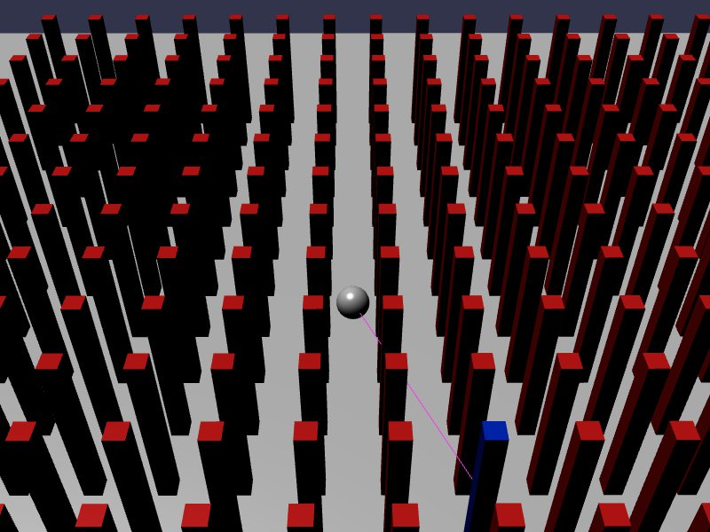

[src/scene/ray_cast.ts](../src/scene/ray_cast.ts)  

### Raycast

This demo uses the Jolt Raycast call. A ray is defined as a point, and a direction vector from that point. The direction vector not only describes a normalized direction, but also includes the distance in that direction as defined by the length of that vector. 

This call performs a Ray-intersect call on all bodies found in a given ray, using the V1 physics interface.

A "hit" of a ray intersection results in the point of contact, the normal of the surface that was hit, and the body of intersected.

The structure of the Demo defines a sphere in the center (purely visual, no Jolt body representation) and a ray traveling in a radar-like rotation around the point.

A grid of Jolt bodies are defined around this point. Each frame, a ray-intersection test is performed, looking for the nearest body. Should a body be intersected, the corresponding BabylonJS model is found and the material is updated from Red to Blue.