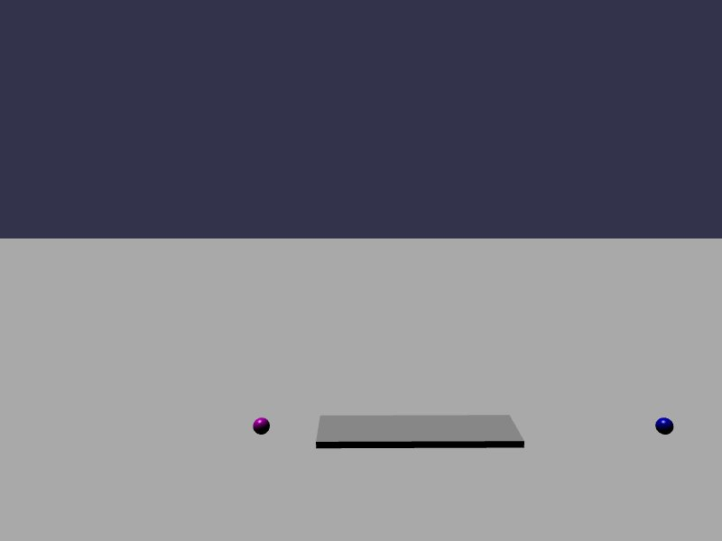

[src/scene/set_motion_type.ts](../src/scene/set_motion_type.ts)

### Set Motion Typed

This demo shows a body that is declared Static initially but uses `allowDynamicOrKinematic` and declares a mass.
This instructs Jolt to store the needed internal data for changing from Static to Dynamic or Kinematic.

Based on a timer, the body will start Static and then turn into Kinematic and strike a nearby block.
After more time, the body will turn into Dynamic and be allowed to fall to the ground.

This demonstrates `setMotionType` as well as the features of the three types of MotionTye:
1) static - immovable
2) kinematic - moving and unstoppable (will not interact with static)
3) dynamic - movable but under the influence of the rules of physics - will collide with kinematic
