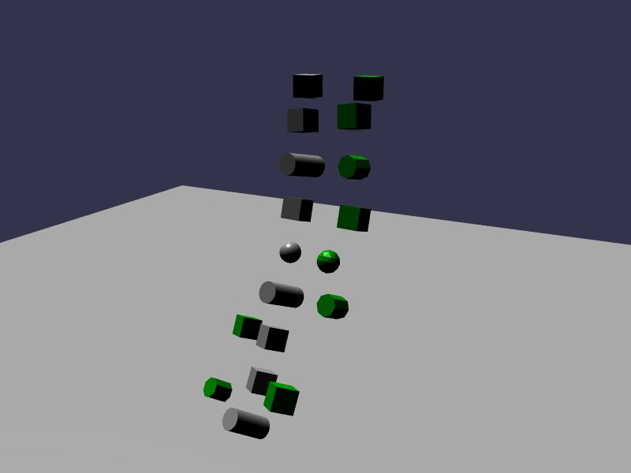

[src/scene/set_shape.ts](../src/scene/set_shape.ts)

### Set Shape

This demo uses the BabylonJS click behavior to register click-handlers on Meshes.
These Meshes are configured in a constraint setup to form a chain.

Clicking on individual items will swap the Shape of the model between Spheres, Boxes, and Cyclinders.
This demonstrates that the Constraints are not broken, and the shape is instead changed on the existing Body.
