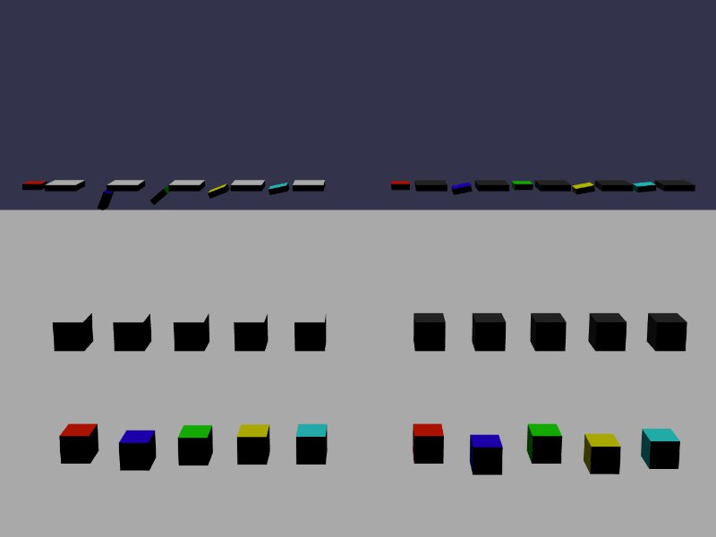

[src/scene/springs.ts](../src/scene/springs.ts)  

### Springs

This demo displays the effect of various Spring settings on constraints.
The main two constraints used are the hinge constraint (above) and distance constraint (below).

The scene is broken up into sets of constraints that have configured Frequency (left, white boxes) and configured Stiffness (right, gray boxes) spring settings. 

The spring settings allow springs to be setup in the two modes, Frequency and Stiffness, as described in the [JoltPhysics CPP Architecture](https://github.com/jrouwe/JoltPhysics/blob/master/Docs/Architecture.md#constraint-motors-constraint-motors) I do not yet fully understand the behavior enough to give a clear description on how to tailor desired spring-like behavior at this time or give good analogy. 