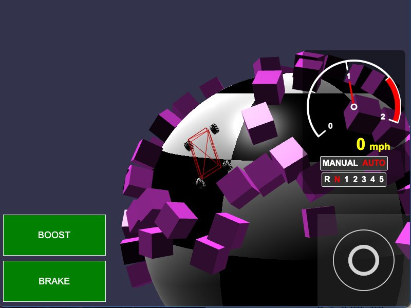

[src/scene/vehicle_kart_ribbon_world.ts](../src/scene/vehicle_kart_ribbon_world.ts)  
[src/scene/vehicle_kart_sphere_world.ts](../src/scene/vehicle_kart_sphere_world.ts)  

### Vehicle Gravity

Vehicles support setting a gravity override, just like [Gravity Override](./gravity_override.md).

This will allow for driving vehicles in non-standard gravity, such as spherical gravity in the mini-planet "Sphere World" demo, or the more abstract "Ribbon World" demo that defines gravity along a twisting surface.
