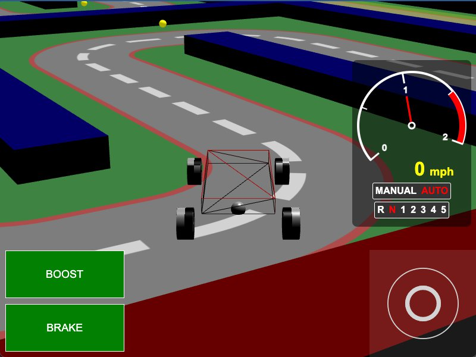

[src/scene/vehicle_kart.ts](../src/scene/vehicle_kart.ts)  

### Vehicle Constraint
See: [Vehicle Doc](./vehicle.md)

### Vehicle: Kart

This demo uses the [Vehicle: Wheeled](./vehicle_wheeled.md) template, bute loads up a map using SVG.

The tires of the vehicle are modified to ensure drastically high traction to allow for tight, high-speed turns.

Walls are setup with physics-system higher walls, but visibly smaller walls to prevent cars from jumping the walls but still allow the user to steer. 

Sensors are setup around the coarse for 2 purposes:
1. Pick-Up items - yellow spheres that do nothing
2. Boost Regions - rectangular sensors setup for forcing the 'boost' button.
